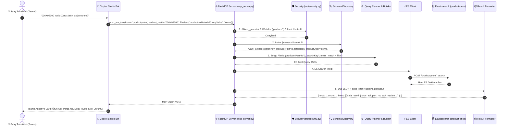

# 🏗️ B2B Satış Temsilcileri Ürün Arama MCP — Uçtan Uca Sistem Mimarisi

Bu doküman, Kurum İçi B2B Satış Temsilcilerinin **MS Teams** üzerinden ürün kataloğunda arama yapması, stok ve Dolar/TL fiyatı sorgulaması için tasarlanmış MCP sunucusunun mimarisini açıklamaktadır.

---

## 🧭 1. Sistemin Büyük Resmi (High-Level Architecture)

```
┌──────────────────────────────────────────────────────────────────────────────────┐
│                         1. MS TEAMS / SATIŞ TEMSİLCİSİ                          │
│       Talep: "036K92300 parça kodlu Xerox ürününün fiyatı ve stoğu nedir?"        │
└────────────────────────────────────────┬─────────────────────────────────────────┘
                                         │ (1. Doğal Dil Mesajı)
                                         ▼
┌──────────────────────────────────────────────────────────────────────────────────┐
│                       2. COPILOT STUDIO (B2B Sales Agent)                        │
│  - NLU ile Intent Extraction (Parça Kodu, Marka, Stok)                           │
│  - index_semasi_getir("product-price") ile alan tiplerini kontrol eder           │
│  - Parametreleri çıkarır:                                                        │
│    index: "product-price", serbest_metin: "036K92300",                           │
│    filtreler: {"product.exMaterialGroupValue": "Xerox"}, limit: 10              │
└────────────────────────────────────────┬─────────────────────────────────────────┘
                                         │ (2. HTTP / MCP Tool Call Request)
                                         ▼
┌──────────────────────────────────────────────────────────────────────────────────┐
│                     3. FASTMCP SUNUCUSU (mcp_server.py)                         │
│                      [Azure Container Apps / Stateless]                          │
│                                                                                  │
│   ┌──────────────────────────────────────────────────────────────────────────┐   │
│   │ A. GÜVENLİK VE VALİDASYON KATMANI (src/security.py)                      │   │
│   │    - @kapi_gerektirir (Yetki kontrolü / penta-mcp-builder)               │   │
│   │    - Wildcard Whitelist Kontrolü ('product-*', 'product-price')          │   │
│   │    - Limit Sınırlandırma (Limit <= 50)                                   │   │
│   │    - Script Enjeksiyon Koruması                                          │   │
│   └────────────────────────────────────┬─────────────────────────────────────┘   │
│                                        │                                         │
│   ┌────────────────────────────────────▼─────────────────────────────────────┐   │
│   │ B. DİNAMİK SORGU PLANLAYICI & YAPI TAŞLARI (src/query_planner + builder)  │   │
│   │    - searchKey^3, producerPartNo^3, name^2 ──► multi_match (must)        │   │
│   │    - totalstock, productUsdPrice, isEol    ──► range/term (filter)       │   │
│   └────────────────────────────────────┬─────────────────────────────────────┘   │
│                                        │                                         │
│   ┌────────────────────────────────────▼─────────────────────────────────────┐   │
│   │ C. ELASTICSEARCH İSTEMCİSİ (src/es_client.py)                            │   │
│   │    - Salt-Okunur Async ES İstemcisi                                      │   │
│   └────────────────────────────────────┬─────────────────────────────────────┘   │
│                                        │                                         │
│   ┌────────────────────────────────────▼─────────────────────────────────────┐   │
│   │ D. SONUÇ BİÇİMLENDİRİCİ (src/result_formatter.py)                        │   │
│   │    - Düz JSON yapısı + satis_ozeti                                       │   │
│   │    - { total, count, items: [{ satis_ozeti: {urun_adi, part_no, stok...}}]│   │
│   └──────────────────────────────────────────────────────────────────────────┘   │
└────────────────────────────────────────┬─────────────────────────────────────────┘
                                         │ (3. Arama İsteği)
                                         ▼
┌──────────────────────────────────────────────────────────────────────────────────┐
│                       4. ELASTICSEARCH VERİ KATMANI                              │
│                        [Index: product-price Cluster]                            │
└──────────────────────────────────────────────────────────────────────────────────┘
```

---

## ⚡ 2. B2B Satış Temsilcisi Sorgu Yaşam Döngüsü



---

## 📦 3. Veri Yapısı ve Haritalama Mantığı

| Satış Alanı | ES Doküman Karşılığı | Açıklama |
|---|---|---|
| **Ürün Adı** | `product.name` / `product.description` | Ürün resmi ticari tanımı |
| **Parça Kodu** | `product.producerPartNo` | Üretici parça numarası (MPN) |
| **Ürün Kodu** | `product.productID` / `_id` | Sistem içi stok ID |
| **Arama Anahtarı** | `searchKey` | Ürün adı, parça kodu, marka ve okunuş/yazım hataları ("zeroks" vb.) |
| **Marka** | `product.exMaterialGroupValue` / `categoryLevel3Name` | Üretici / Marka adı |
| **Stok Toplamı** | `product.totalstock` | Toplam kullanılabilir stok |
| **USD Fiyatı** | `productUsdPrice` / `price.dealerPrice` | Bayi Dolar fiyatı |
| **TRY Fiyatı** | `productTryPrice` / `productSKTryPrice` | Bayi TL fiyatı |
| **Kategori** | `categoryName` | Tam hiyerarşik kategori dizesi |
